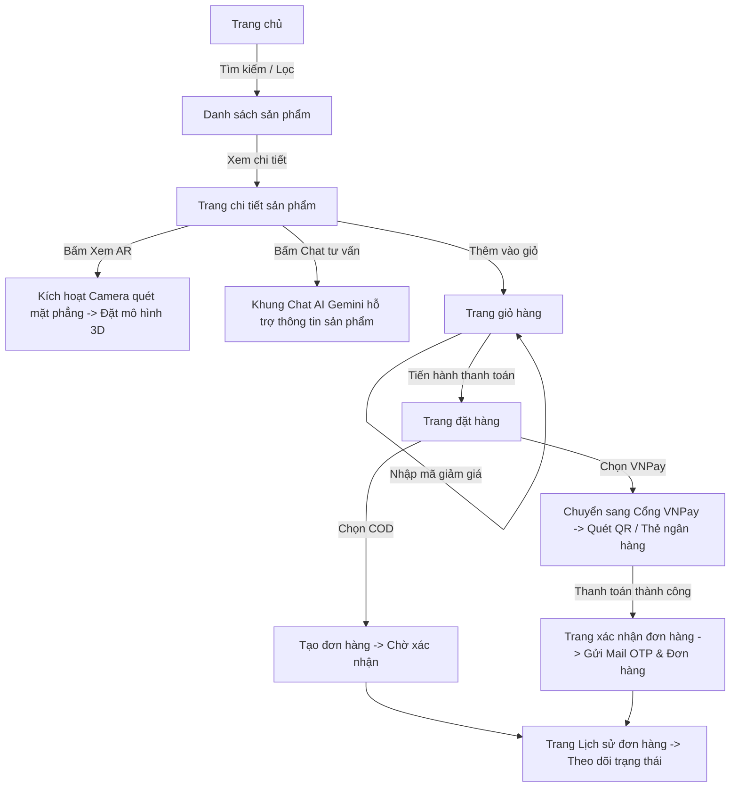
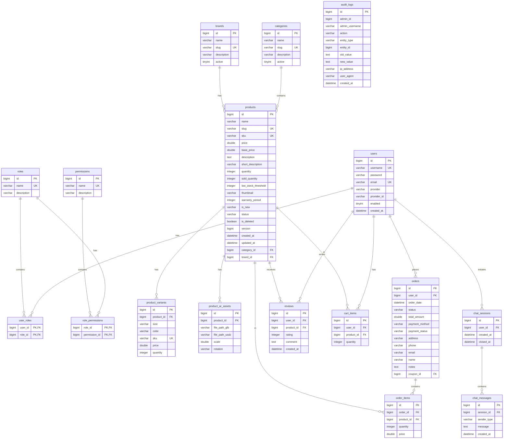

# TÀI LIỆU THIẾT KẾ HỆ THỐNG PD-SHOP
## SRS · USE CASE · WIREFRAME · ERD
---

> **Dự án:** Hệ thống Thương mại Điện tử PD-Shop  
> **Sinh viên thực hiện:** Dương Duy Phúc  
> **Công nghệ sử dụng:** Spring Boot, React.js, MySQL, WebAR, Gemini AI, VNPay, Docker, AWS  

Tài liệu này tổng hợp đầy đủ các tài nguyên thiết kế hệ thống quan trọng phục vụ cho việc lưu trữ, phát triển và bảo vệ đồ án tốt nghiệp.

---

## I. SRS (SOFTWARE REQUIREMENT SPECIFICATION - ĐẶC TẢ YÊU CẦU)

### 1.1. Yêu cầu chức năng (Functional Requirements)

Hệ thống được chia thành 3 phân hệ chính theo quyền hạn của người dùng:

| Phân hệ | Nhóm chức năng | Mô tả chi tiết yêu cầu |
| :--- | :--- | :--- |
| **Khách hàng (Customer)** | **Quản lý tài khoản** | Đăng ký (xác thực OTP email), Đăng nhập (thường & Google OAuth2), Quên mật khẩu. |
| | **Mua sắm trực tuyến** | Duyệt danh mục/thương hiệu, Tìm kiếm, Lọc sản phẩm, Xem chi tiết sản phẩm. |
| | **Trải nghiệm WebAR** | Xem mô hình 3D tỉ lệ 1:1 trong không gian thực qua camera di động (Android & iOS). |
| | **Tư vấn AI Chatbot** | Trò chuyện trực tuyến với AI tư vấn sản phẩm thông minh dựa trên dữ liệu thật của kho. |
| | **Giỏ hàng & Thanh toán**| Thêm/sửa/xóa giỏ hàng, áp mã giảm giá (coupon), thanh toán COD hoặc qua cổng VNPay. |
| | **Theo dõi đơn hàng** | Xem lịch sử đơn hàng, xem trạng thái vận chuyển, hủy đơn hàng chưa xử lý. |
| | **Tương tác & Đánh giá** | Viết đánh giá sản phẩm, xếp hạng sao kèm hình ảnh thực tế. |
| **Nhân viên (Staff)** | **Xử lý đơn hàng** | Xem danh sách đơn hàng toàn hệ thống, cập nhật trạng thái đơn (Chờ xử lý -> Đang giao -> Đã giao). |
| **Quản trị (Admin)** | **Quản lý sản phẩm** | CRUD sản phẩm, danh mục, thương hiệu. Upload ảnh & liên kết file 3D (.glb, .usdz). |
| | **Nhập liệu hàng loạt** | Import hàng loạt sản phẩm từ file Excel (.xlsx), tự động cập nhật hoặc bỏ qua khi trùng SKU. |
| | **Quản lý tài nguyên AR**| Quản lý assets 3D, điều chỉnh scale, rotation, cấu hình điểm tương tác (hotspots). |
| | **Thống kê & Báo cáo** | Biểu đồ doanh thu theo thời gian, thống kê đơn hàng mới, sản phẩm bán chạy, khách hàng mới. |
| | **Kiểm toán (Audit Log)** | Ghi nhận tự động nhật ký mọi thao tác thay đổi dữ liệu của Admin/Staff (ai làm, làm gì, lúc nào, giá trị cũ/mới). |

### 1.2. Yêu cầu phi chức năng (Non-Functional Requirements)

*   **Bảo mật:**
    *   Mật khẩu người dùng bắt buộc phải được mã hóa bằng thuật toán BCrypt trước khi lưu vào database.
    *   Xác thực không trạng thái (Stateless Authentication) qua JWT Token với thời hạn 24 giờ.
    *   Phân quyền người dùng dựa trên vai trò (Role-Based Access Control - RBAC) tại cả Frontend (Route Guards) và Backend API (`@PreAuthorize`).
    *   Chống brute-force và spam API nhạy cảm bằng cơ chế giới hạn tần suất (Rate Limiting) tối đa 5 requests/phút/IP.
*   **Hiệu năng & Tối ưu:**
    *   Tốc độ phản hồi API trung bình dưới 200ms.
    *   Ghi log hệ thống và gửi email xác thực OTP chạy bất đồng bộ (`@Async`) để không chặn luồng chính của khách hàng.
    *   Tối ưu hóa ghi dữ liệu lớn qua JDBC Batch Inserts (batch size = 50) khi import Excel.
    *   Nén mô hình 3D bằng Draco Compression để giảm dung lượng file xuống dưới 2MB, tăng tốc độ tải trên thiết bị di động.
*   **Hạ tầng & Triển khai:**
    *   Toàn bộ hệ thống được container hóa bằng Docker và chạy qua Docker Compose trên AWS EC2.
    *   Nginx làm Reverse Proxy đứng cổng 80/443 để serve file tĩnh React, định tuyến API đến Spring Boot và xử lý cấu hình CORS an toàn.

---

## II. USE CASE (SƠ ĐỒ & ĐẶC TẢ CA SỬ DỤNG)

### 2.1. Sơ đồ Use Case tổng thể

Dưới đây là sơ đồ Use Case biểu diễn tương tác giữa các tác nhân (Actors) và các tính năng nghiệp vụ của hệ thống PD-Shop:

```mermaid
graph TD
    %% Tác nhân %%
    Customer((Khách hàng))
    Staff((Nhân viên))
    Admin((Quản trị viên))

    %% Use Cases Khách hàng %%
    UC_Login(Đăng ký / Đăng nhập)
    UC_Browse(Duyệt & Tìm kiếm sản phẩm)
    UC_AR(Xem sản phẩm 3D / AR)
    UC_Chat(Chat với AI tư vấn)
    UC_Cart(Quản lý giỏ hàng)
    UC_Checkout(Thanh toán VNPay / COD)
    UC_Track(Theo dõi đơn hàng)
    UC_Review(Đánh giá sản phẩm)

    %% Use Cases Nhân viên %%
    UC_ManageOrder(Xử lý đơn hàng)

    %% Use Cases Admin %%
    UC_CRUD_Product(Quản lý sản phẩm)
    UC_ImportExcel(Import Excel hàng loạt)
    UC_ManageAR(Quản lý Assets 3D/AR)
    UC_Dashboard(Xem thống kê doanh thu)
    UC_Audit(Xem nhật ký Audit Log)

    %% Liên kết Khách hàng %%
    Customer --> UC_Login
    Customer --> UC_Browse
    Customer --> UC_AR
    Customer --> UC_Chat
    Customer --> UC_Cart
    Customer --> UC_Checkout
    Customer --> UC_Track
    Customer --> UC_Review

    %% Liên kết Nhân viên %%
    Staff --> UC_ManageOrder

    %% Liên kết Admin %%
    Admin --> UC_CRUD_Product
    Admin --> UC_ImportExcel
    Admin --> UC_ManageAR
    Admin --> UC_Dashboard
    Admin --> UC_Audit
    Admin --> UC_ManageOrder
```



---

## III. WIREFRAME & USER FLOW (LUỒNG GIAO DIỆN)

### 3.1. Luồng trải nghiệm mua sắm của Khách hàng (User Flow)

Sơ đồ thể hiện luồng di chuyển của khách hàng từ khi truy cập hệ thống đến khi thanh toán thành công đơn hàng:



### 3.2. Cấu trúc Wireframe của các trang cốt lõi

Dưới đây là cấu trúc Wireframe mô tả cách bố trí các thành phần trên giao diện ứng dụng:

#### A. Trang chi tiết sản phẩm (Tích hợp WebAR & Chatbot AI)
```
+---------------------------------------------------------------------------------+
| [PD-SHOP LOGO]             [Tìm kiếm sản phẩm...]       [Giỏ hàng (2)]  [Admin] |
+---------------------------------------------------------------------------------+
| Trang chủ > Điện thoại > iPhone 16 Pro Max                                      |
|                                                                                 |
|  +---------------------------+   +--------------------------------------------+ |
|  |                           |   | iPhone 16 Pro Max                          | |
|  |                           |   | SKU: IP16PM-256                            | |
|  |      Ảnh Thumbnail        |   | Giá: 34.990.000đ  (Gốc: 36.990.000đ)       | |
|  |         Sản phẩm          |   |                                            | |
|  |           (2D)            |   | [Màu sắc: Titan]  [Dung lượng: 256GB]      | |
|  |                           |   |                                            | |
|  |  +---------------------+  |   | [ THÊM VÀO GIỎ HÀNG ]                      | |
|  |  |    Bấm Xem 3D/AR    |  |   |                                            | |
|  |  | (Kích hoạt Camera)  |  |   | [!] Bảo hành 12 tháng chính hãng.          | |
|  |  +---------------------+  |   +--------------------------------------------+ |
|  +---------------------------+                                                  |
|                                                                                 |
|  +---------------------------+   +--------------------------------------------+ |
|  | Thông tin chi tiết        |   | Đánh giá từ khách hàng                     | |
|  | - Chip A18 Pro mạnh mẽ    |   | Nguyễn Văn A: ⭐⭐⭐⭐⭐ "AR quét rất chuẩn!" | |
|  | - Camera control cải tiến |   | Trần Thị B: ⭐⭐⭐⭐ "Đóng gói đẹp"         | |
|  +---------------------------+   +--------------------------------------------+ |
+---------------------------------------------------------------------------------+
| [Trợ lý AI 💬]  <--- Nút nổi góc phải màn hình, bấm vào sẽ hiển thị cửa sổ chat|
+---------------------------------------------------------------------------------+
```

#### B. Trang quản trị Admin Dashboard
```
+---------------------------------------------------------------------------------+
| [PD-SHOP ADMIN]                                            [👤 admin (Log out)]|
+---------------------------------------------------------------------------------+
|  Mục quản trị   |  BÁO CÁO KINH DOANH TỔNG QUAN                                |
|  -------------  |  +------------------+  +------------------+  +-------------+  |
|  [DASHBOARD]    |  | Doanh thu tháng  |  | Đơn hàng mới     |  | Tồn kho thấp|  |
|  [Sản phẩm]     |  | 145.200.000đ     |  | 32 Đơn           |  | 5 Sản phẩm  |  |
|  [Đơn hàng]     |  +------------------+  +------------------+  +-------------+  |
|  [Assets 3D]    |                                                               |
|  [Khách hàng]   |  BIỂU ĐỒ DOANH THU THEO TUẦN (Recharts)                       |
|  [Nhật ký log]  |   Doanh thu                                                   |
|                 |    ^                                                          |
|                 |    |      /\                                                  |
|                 |    |   _ /  \                                                 |
|                 |    |  /      \_____                                           |
|                 |    +----------------------> Thứ                               |
|                 |       2   3   4   5   6                                       |
+---------------------------------------------------------------------------------+
```

---

## IV. ERD (ENTITY RELATIONSHIP DIAGRAM - THIẾT KẾ CƠ SỞ DỮ LIỆU)

Hệ thống sử dụng cơ sở dữ liệu quan hệ **MySQL 8.0** được chuẩn hóa ở mức **3NF**. Dưới đây là sơ đồ thực thể liên kết (ERD) chi tiết:



---
*Tài liệu được sinh tự động nhằm mục đích hỗ trợ việc bảo vệ và kiểm thử đồ án tốt nghiệp của sinh viên Dương Duy Phúc.*
